

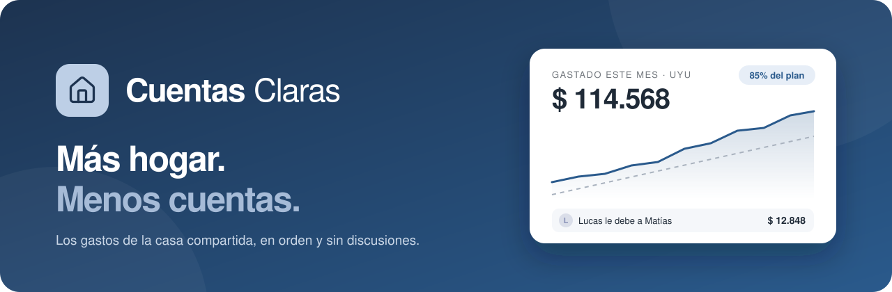

 

### Una foto al ticket y las cuentas de la casa se hacen solas.

 

<!-- Reemplazá URL_DE_LA_DEMO por el link de la demo publicada (aparece dos veces en este archivo). -->

---

**¿Quién pagó el súper? ¿Cuánto nos queda del presupuesto? ¿Cuánto le debo a Sofía?**
Cuentas Claras junta todos los gastos de la casa en un solo lugar y responde esas preguntas por vos. Sacás una foto del ticket, la IA hace el resto, y las cuentas entre los que conviven quedan claras sin planillas ni discusiones.

  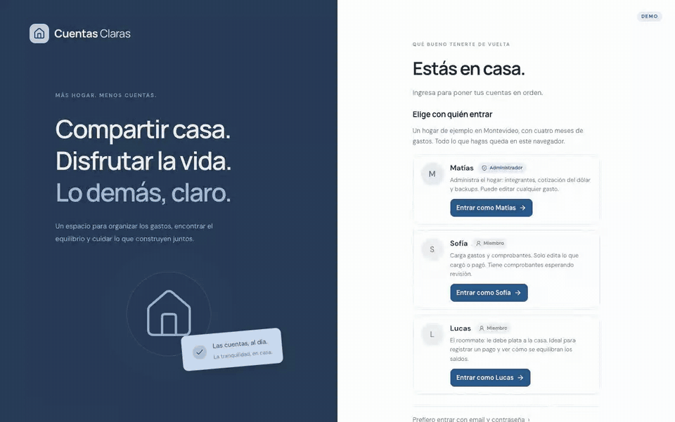
   Del ticket a tus cuentas en segundos: la IA lee, vos confirmás.

## ✨ Todo lo que necesita una casa compartida

| | |
|---|---|
| 📸 **Sacale una foto y listo** La IA lee tickets, facturas de UTE u OSE y capturas del home banking, y te propone los gastos ya completos para que solo confirmes. | 💬 **Contalo como se lo contarías a alguien** Escribí *"Súper 2.350 en Tienda Inglesa con débito, entre todos"* y el gasto queda cargado, dividido y en su categoría. |
| 🤝 **Cuentas claras, convivencia larga** Dividí en partes iguales, por porcentaje, por proporciones o por montos exactos. La app te dice quién le debe a quién con la menor cantidad de transferencias. | 🎯 **Un presupuesto que te avisa antes** Definí cuánto quieren gastar en total y por categoría. Te alerta cuando te acercás al límite y te muestra cómo va a cerrar el mes. |
| 📊 **Entendé a dónde se va la plata** Tendencias, comparación con el mes anterior, los comercios donde más gastan y un informe mensual con ideas concretas para ahorrar. | 🔁 **Que no se te pase ningún vencimiento** El alquiler y los gastos comunes se registran solos. La luz y el agua te esperan para que confirmes el monto real. |
| 💳 **Cuotas sin cuentas raras** Comprás la tele en 12 cuotas y cada mes aparece lo que corresponde, sin hacer cálculos ni acordarte de nada. | 💵 **Pesos uruguayos y dólares, sin drama** Cargá Netflix o un pasaje en dólares y todo se suma en pesos uruguayos con la cotización del día. |
| 🕵️ **Chau gastos duplicados** Si alguien ya cargó ese ticket, la app te avisa antes de que lo sumes dos veces. | 📱 **En el bolsillo de todos** Pensada primero para el celular: cargás un gasto en segundos, desde la caja del súper o desde el sillón. |

## 👀 Miralo en acción

  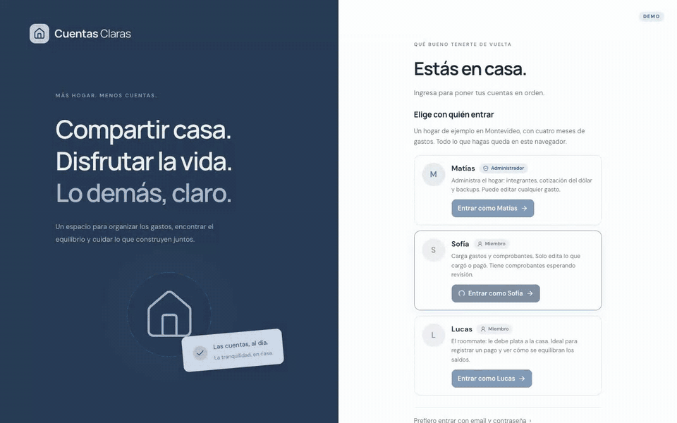
   Escribilo como te salga: la IA entiende el monto, el comercio, la tarjeta y cómo dividirlo.

 

| | |
|:---:|:---:|
| 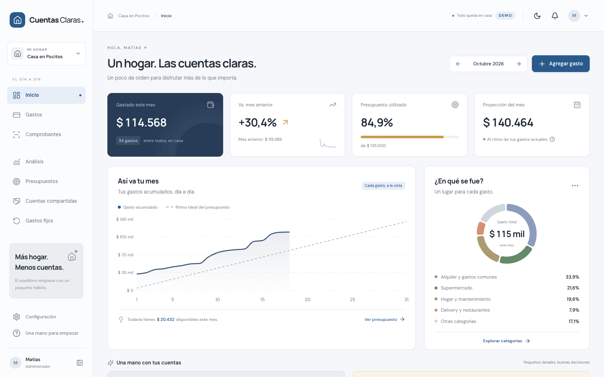 **Tu mes de un vistazo** Cuánto llevan gastado, cuánto queda y cómo viene el ritmo. | 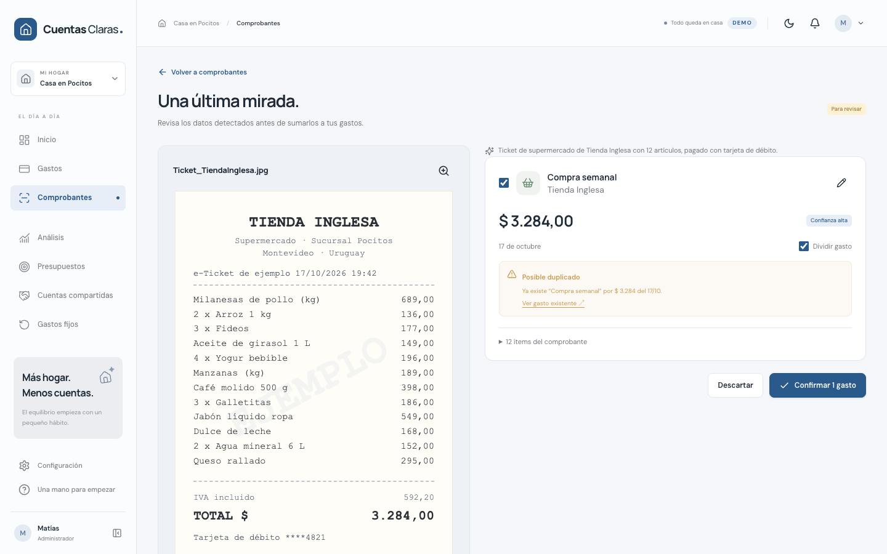 **La IA lee, vos decidís** Cada ítem del ticket, con aviso de posibles duplicados. |
| 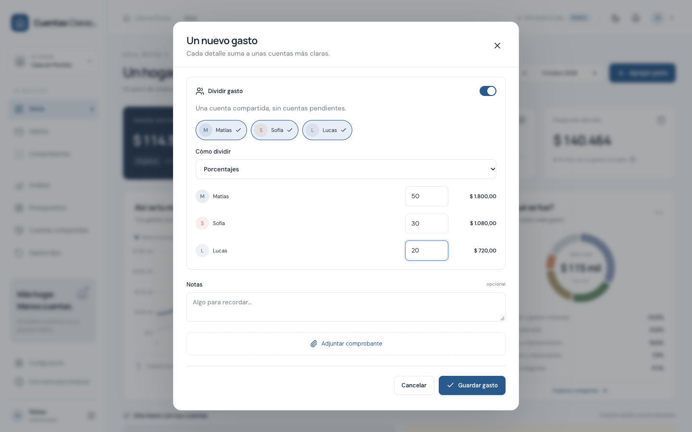 **Cada uno pone lo que le toca** Partes iguales, porcentajes, proporciones o montos exactos. | 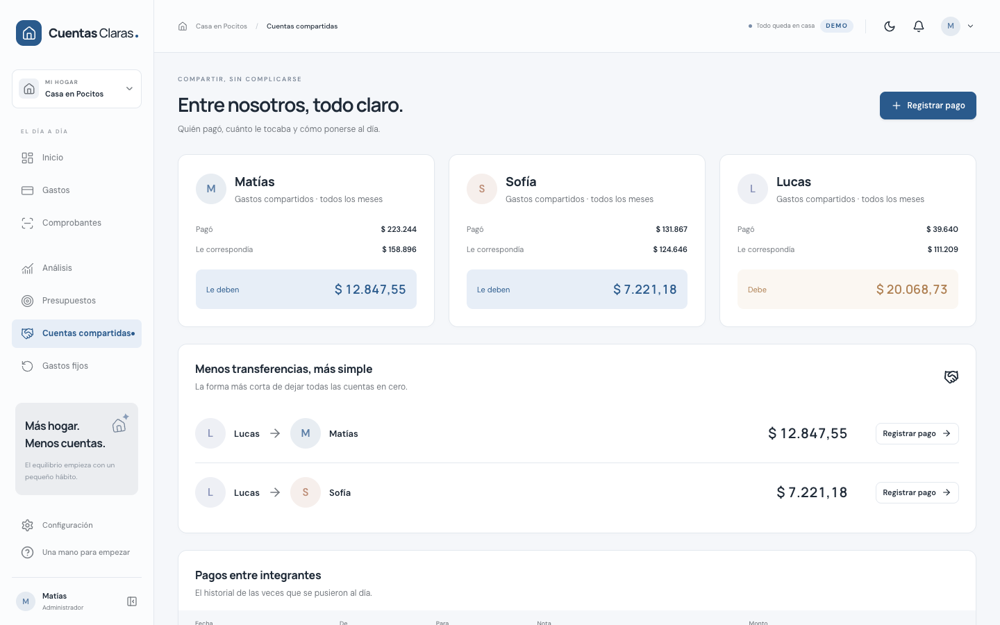 **Quién le debe a quién** Con la menor cantidad de transferencias para quedar a mano. |
| 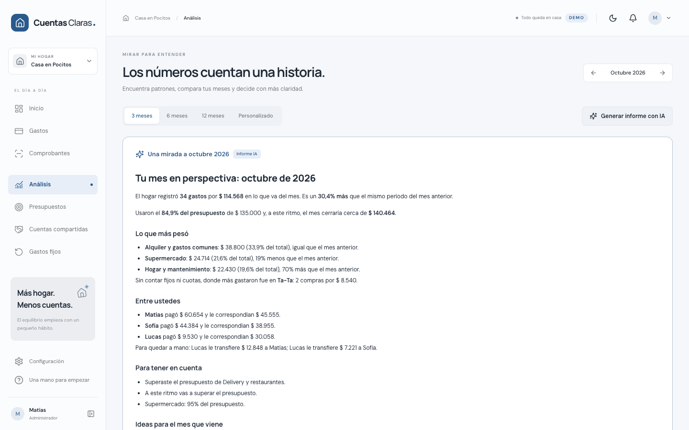 **Un informe que te habla claro** Qué pesó más, cómo vienen y qué cambiar el mes que viene. | 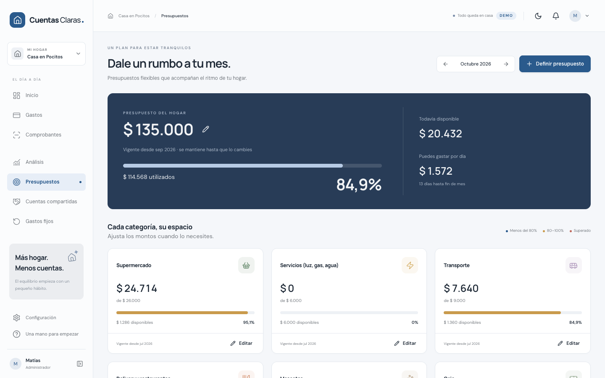 **Un plan para estar tranquilos** Presupuesto total y por categoría, con lo que podés gastar por día. |
| 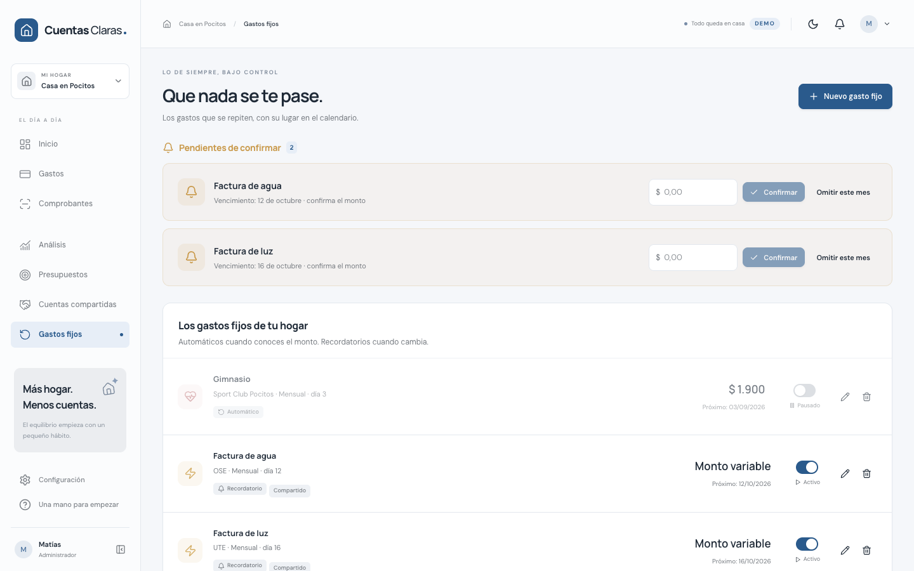 **Lo de siempre, bajo control** Alquiler, internet, UTE, OSE: nada se te pasa. | 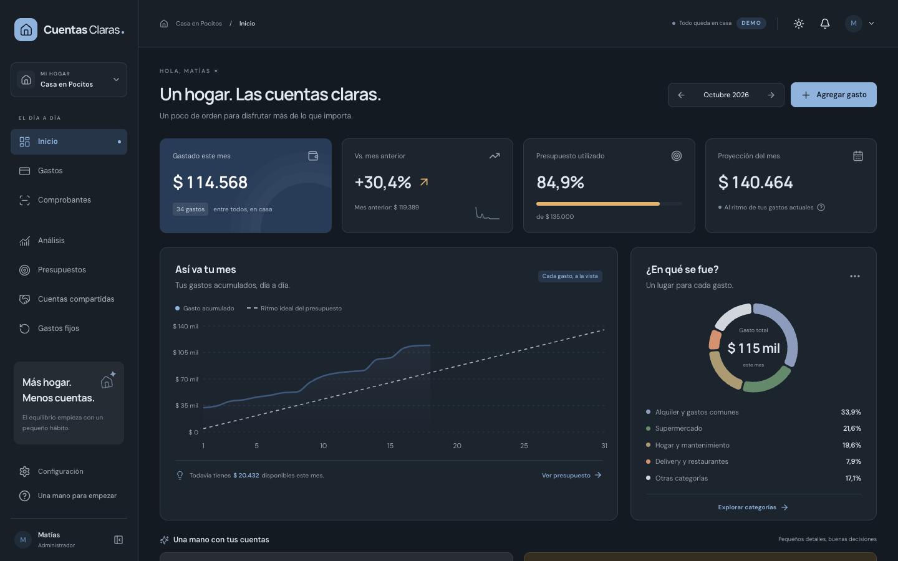 **De día o de noche** Modo claro y oscuro, como más te guste. |

  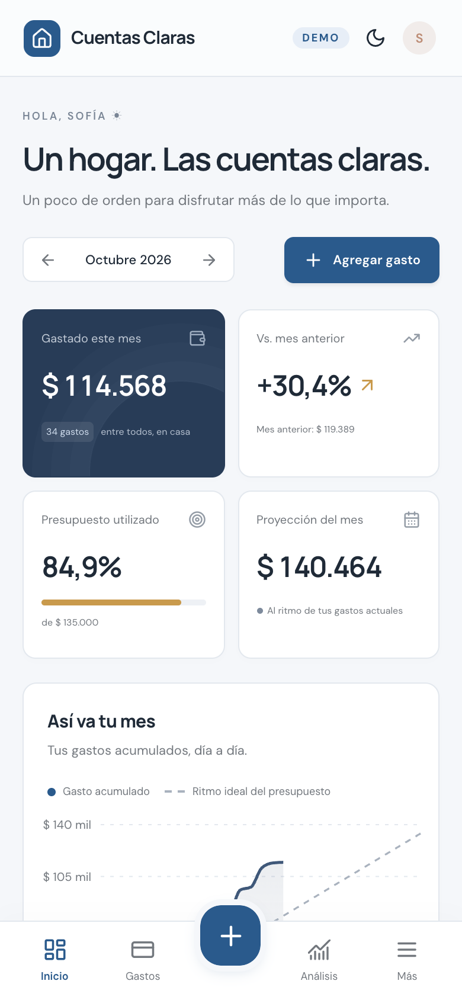&nbsp;
  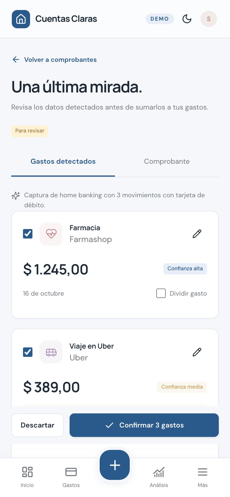&nbsp;
  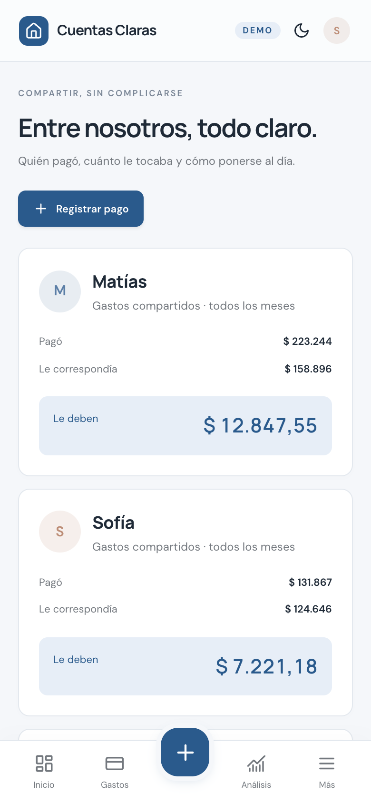
   Y en el celular, igual de simple.

## 🏡 ¿Para quién es?

| Perfil | Lo que gana |
|---|---|
| 👫 **Parejas que conviven** | Dejan de llevar la cuenta en la cabeza. Cada gasto queda registrado con quién lo pagó y cuánto le toca a cada uno, aunque no sea mitad y mitad. |
| 🏠 **Roommates y apartamentos compartidos** | Alquiler, gastos comunes y súper divididos de forma justa. El que debe sabe exactamente cuánto y a quién, y quedan a mano con la menor cantidad de transferencias. |
| 👨‍👩‍👧 **Familias** | Un presupuesto mensual que se cumple, vencimientos que no se pasan y una foto clara de en qué se va la plata de la casa. |
| 🧾 **El que siempre termina haciendo las cuentas** | Se acabó perseguir tickets y armar planillas a fin de mes. Cada uno carga lo suyo en segundos y la app hace los números. |
| 🛡️ **Quien administra el hogar** | Suma integrantes, ajusta la cotización del dólar, define los presupuestos y tiene la última palabra sobre cualquier gasto. |
| 🙋 **Cada integrante** | Carga sus gastos, ve su saldo en tiempo real y solo puede tocar lo que cargó o pagó él. Cero sorpresas. |

## 🧪 Probala en 5 minutos

La demo trae un hogar de ejemplo en Pocitos con Matías, Sofía y Lucas, cuatro meses de gastos en pesos uruguayos y algunas cosas pendientes para que pruebes:

- 📸 Escaneá un ticket de ejemplo y mirá cómo la IA detecta un **gasto duplicado**.
- 💬 Escribí un gasto como si fuera un mensaje y confirmalo.
- 🤝 Entrá como **Lucas** y saldá lo que le debe a la casa.
- 🔁 Confirmá la factura de UTE que quedó pendiente.
- 🎯 Ajustá el presupuesto de delivery, que este mes se pasó.

Entrás con un clic, sin crear cuenta, y nada de lo que hagas sale de tu navegador.

  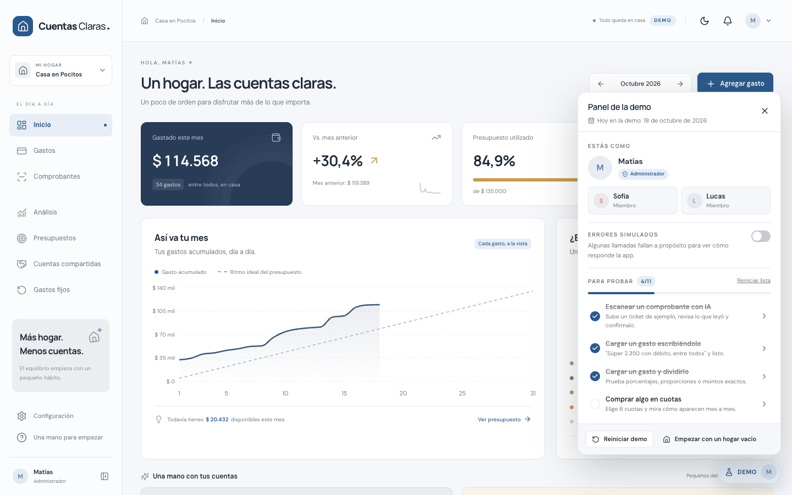
   Un panel para cambiar de usuario en un clic, volver a empezar o ver cómo responde la app ante un error.

---

## ¿Listo para tener las cuentas claras?

**Probala ahora: en dos minutos vas a entender por qué no querés volver a la planilla.**

 

¿Querés usar Cuentas Claras en tu casa o tenés una idea para sumar?
<!-- Reemplazá EMAIL_DE_CONTACTO por tu email (aparece dos veces en esta línea). -->
Escribinos a **[EMAIL_DE_CONTACTO](mailto:EMAIL_DE_CONTACTO)**: te respondemos con gusto.

Hecho en Uruguay 🇺🇾 para que compartir casa sea más fácil.

